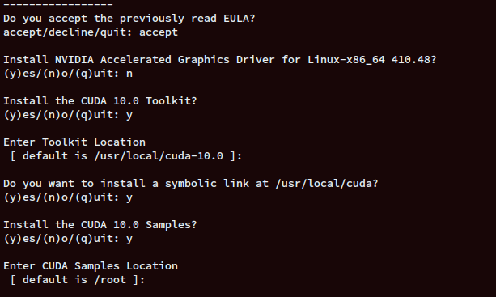

Download all specified packages and put them in this directory, inside `/download`
 

**Note:**
You need a nvidia membership account download

|Packages|Url|
|---|---|
|CUDA 10.0 RUN file (Linux, x86_64, Ubuntu, 18.04) |https://developer.nvidia.com/cuda-10.0-download-archive|
|cuDNN 7.6.5 for CUDA 10.0 (Runtime, Developer, Code Samples)|https://developer.nvidia.com/rdp/cudnn-archive|
|TensorRT 7.0.0.11 (Ubuntu 18.04 CUDA 10.0 TAR)|https://developer.nvidia.com/nvidia-tensorrt-7x-download|
|NGC Cli (Download CLI)|https://ngc.nvidia.com/setup/installers/cli|

## Some key note
The image is split into 2 build phase
1. ubuntu-18.04-CUDA10
2. ubuntu-18.04-tensorRT-cuDNN7

The `ubuntu-18.04-CUDA10` require interactive installation. The dockerfile is just setup some pre-requisite packages and download repos. Right after you build the image, perform `docker run -it ` and execute `/install-cuda10-nvidia450.sh` by your self. After installation, create new terminal and commit running docker, tag it whatever you want. And we done, use this image as the base for `ubuntu-18.04-tensorRT-cuDNN7`
 
 
While installation, there's a time when terminal display a term and agreement. To quickly navigate to to bottom, hold `s`. Till you read the bottom, follow the instruction, input options as below
  
